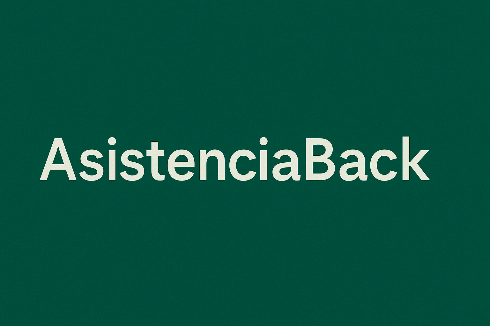

<p align="center">
  
</p>

---

## 🚀 Descripción

AsistenciaBack es el backend desarrollado en Spring Boot para la aplicación de gestión de asistencia del restaurante Pasapalos.  
Gestiona usuarios, fichajes, roles y proporciona una API segura y eficiente para el frontend.

---

## 🛠 Tecnologías usadas

<p align="center">
  
  
  
  
</p>

---
## 🔑 Configuración
Configura la conexión a la base de datos en el archivo application.properties o application.yml.

Ajusta las variables de entorno para seguridad y JWT.

---

## 🛠 API Endpoints principales

POST /api/auth/login - Autenticación de usuarios.

GET /api/users - Listar usuarios (solo admins).

POST /api/fichajes - Registrar fichajes.

GET /api/fichajes/{userId} - Obtener fichajes de un usuario.

---

## 🤝 Contribuciones
Las contribuciones son bienvenidas. Abre issues o pull requests para sugerir mejoras o correcciones.

---


¡Gracias por visitar y colaborar en este proyecto! 🚀


## 💻 Instalación

```bash
git clone https://github.com/nelcygarcia/AsistenciaBack.git
cd AsistenciaBack
./mvnw clean install
./mvnw spring-boot:run
